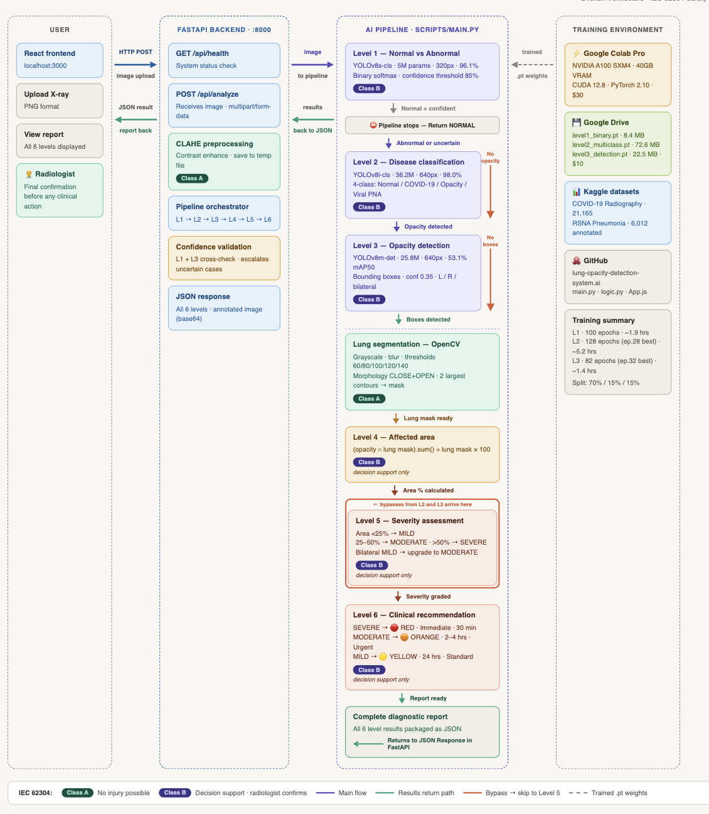
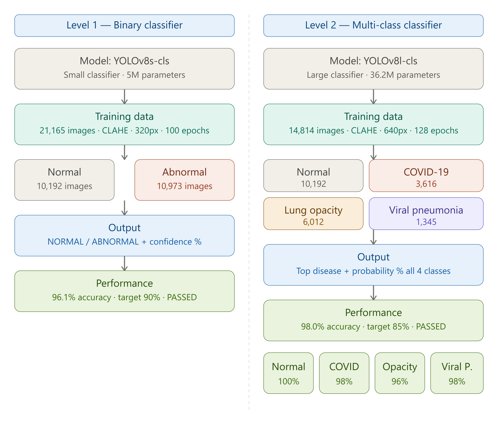
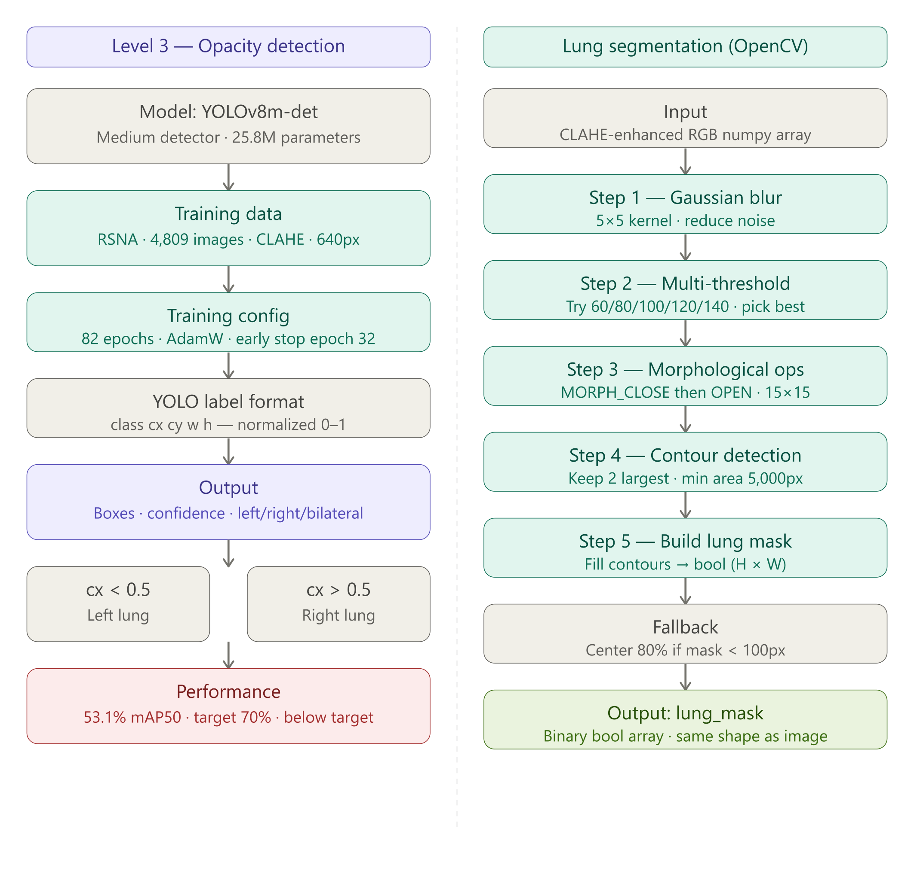
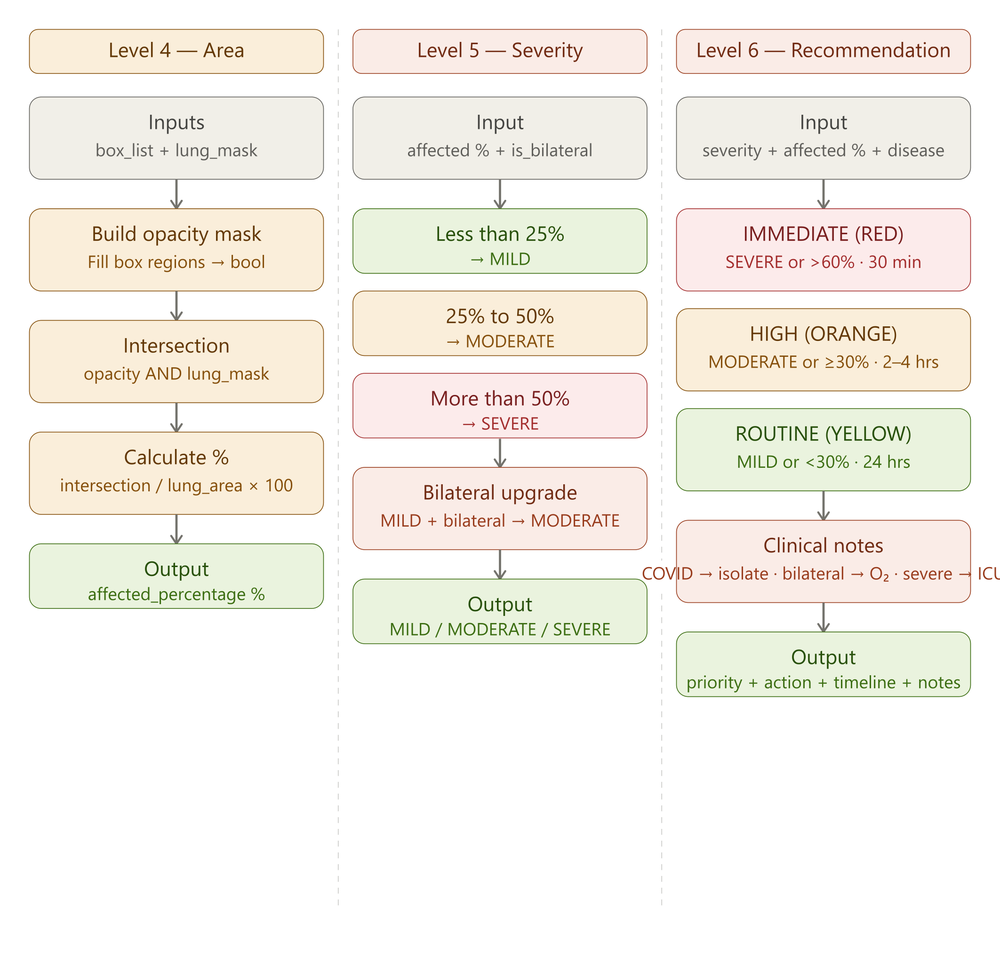

# AI-Based Lung Opacity Detection System

An AI-powered chest X-ray diagnostic tool that analyzes medical images through a 6-level pipeline — screening, disease classification, location detection, severity assessment, and clinical recommendations — delivering a complete diagnostic report in under 10 seconds.

> **Disclaimer:** This system is developed for academic research purposes only. It is not intended for clinical diagnosis or medical decision-making without review and confirmation by a licensed medical professional.

## Table of Contents

- [Overview](#overview)
- [Architecture](#architecture)
- [Features](#features)
- [Technologies](#technologies)
- [Infrastructure](#infrastructure)
- [Performance](#performance)
- [Deployment](#deployment)
- [Known Limitations](#known-limitations)
- [Future Enhancements](#future-enhancements)
- [Academic Context](#academic-context)

---

## Overview

### The Problem

Lung opacity — the appearance of white or hazy regions on chest X-rays — is a critical diagnostic indicator for serious conditions including pneumonia, COVID-19, tuberculosis, and lung cancer. Despite its clinical importance, the current state of radiology presents significant challenges:

- Radiologists spend **5–10 minutes** analyzing a single chest X-ray manually
- A projected global shortage of **2.3 million radiologists** by 2030
- **20–30% inter-observer disagreement** between doctors reviewing the same X-ray
- COVID-19 created a **300–400% surge** in chest imaging demand, overwhelming hospital capacity
- Delayed pneumonia diagnosis directly increases patient mortality from **8% to 20–30%**
- Over **70% of the world** lacks adequate access to trained radiologists

In emergency departments, rural clinics, and high-volume hospitals, these bottlenecks translate directly into delayed treatment and preventable deaths.

### The Solution

This system acts as a **first-line AI screening assistant** that instantly analyzes a chest X-ray and produces a structured 6-level diagnostic report. It is designed to:

- Screen abnormal X-rays instantly so radiologists focus only on cases that need attention
- Classify the likely disease with 98% accuracy across 4 categories
- Detect and localize opacity regions with bounding box overlays
- Calculate what percentage of actual lung tissue is affected using OpenCV-based lung segmentation
- Grade clinical severity and generate triage priority recommendations

The system uses **YOLOv8**, a state-of-the-art unified deep learning framework, for all three AI models — reducing development complexity while maintaining high accuracy.

### Dataset Summary

| Dataset | Source | Images | Purpose |
|---------|--------|--------|---------|
| COVID-19 Radiography Database | Kaggle | 21,165 | Levels 1 and 2 training |
| RSNA Pneumonia Detection Challenge | Kaggle | 6,012 annotated | Level 3 training |

**Class Distribution:**

| Class | Images | Percentage |
|-------|--------|------------|
| Normal | 10,192 | 48.2% |
| Lung Opacity | 6,012 | 28.4% |
| COVID-19 | 3,616 | 17.1% |
| Viral Pneumonia | 1,345 | 6.3% |
| **Total** | **21,165** | **100%** |

**Data Split:** 70% Train / 15% Validation / 15% Test (stratified to maintain class balance)

---

## Architecture

### Architectural Diagram Color Legend

The system architecture diagrams use the following color coding across all module diagrams:

| Color | Meaning | Used For |
|-------|---------|----------|
| Blue | AI classification models | Level 1 and Level 2 YOLOv8 classifiers |
| Purple | AI detection model | Level 3 YOLOv8 object detector |
| Teal | Data pipeline and preprocessing | CLAHE enhancement, training data, lung segmentation steps |
| Amber | Quantification logic | Level 4 area calculation and math |
| Coral | Clinical decision logic | Level 5 severity assessment and Level 6 recommendation |
| Green | Positive outcomes and passed metrics | Performance results that met targets, final outputs |
| Red | Warning and below target | Level 3 performance below 70% mAP50 target |
| Gray | Neutral and structural | Inputs, outputs, model specifications, fallback logic |

### Diagram 1 — System Architecture Overview
*Complete 6-level diagnostic pipeline from image upload to final report*



### Diagram 2 — Level 1 and Level 2 Module Detail
*Binary classifier (YOLOv8s-cls) and multi-class classifier (YOLOv8l-cls) — model specs, training data, class distribution, and performance*



### Diagram 3 — Level 3 Detection and Lung Segmentation Module Detail
*YOLOv8s-det opacity detector and OpenCV-based lung segmentation pipeline — 5-step mask extraction process*



### Diagram 4 — Level 4, 5 and 6 Module Detail
*Affected area intersection math, severity assessment rules, and clinical recommendation decision tree*



### System Flow

```
┌──────────────────────────────────────────────────────────┐
│                     REACT FRONTEND                        │
│   User uploads chest X-ray → Analyze button → Results    │
└───────────────────────┬──────────────────────────────────┘
                        │  HTTP POST /api/analyze
                        │  (multipart/form-data)
                        ▼
┌──────────────────────────────────────────────────────────┐
│                   FASTAPI BACKEND                         │
│   Receives image → CLAHE enhancement → Lung segmentation │
│   → Runs 6-level pipeline → Returns structured JSON      │
└───────────────────────┬──────────────────────────────────┘
                        │
           ┌────────────▼────────────┐
           │     6-LEVEL PIPELINE    │
           └────────────┬────────────┘
                        │
       ┌────────────────▼────────────────┐
       │  LEVEL 1 — Normal vs Abnormal   │  [BLUE — AI classifier]
       │  Model: YOLOv8s-cls             │
       │  Params: 5M                     │
       │  Accuracy: 96.1%                │
       └────────────────┬────────────────┘
                        │ If confidently NORMAL → Stop
                        │ If ABNORMAL or uncertain → Continue
                        ▼
       ┌────────────────────────────────┐
       │  LEVEL 3 — Opacity Detection   │  [PURPLE — AI detector]
       │  Model: YOLOv8m-det            │  Runs on EVERY image
       │  Params: 25.8M                 │  as independent safety check
       │  mAP50: 53.1%                  │
       └────────────────┬───────────────┘
                        │
                        ▼
       ┌────────────────────────────────┐
       │  LEVEL 2 — Disease             │  [BLUE — AI classifier]
       │  Classification                │
       │  Model: YOLOv8l-cls            │
       │  Params: 36.2M                 │
       │  Accuracy: 98.0%               │
       └────────────────┬───────────────┘
                        │
                        ▼
       ┌────────────────────────────────┐
       │  Lung Segmentation (OpenCV)    │  [TEAL — preprocessing]
       │  Multi-threshold + morphology  │
       │  Extracts precise lung mask    │
       └────────────────┬───────────────┘
                        │
                        ▼
       ┌────────────────────────────────┐
       │  LEVEL 4 — Affected Area       │  [AMBER — quantification]
       │  (opacity ∩ lung mask)         │
       │  ÷ lung mask area × 100        │
       └────────────────┬───────────────┘
                        │
                        ▼
       ┌────────────────────────────────┐
       │  LEVEL 5 — Severity Assessment │  [CORAL — clinical logic]
       │  Rule-based thresholds         │
       │  MILD / MODERATE / SEVERE      │
       └────────────────┬───────────────┘
                        │
                        ▼
       ┌────────────────────────────────┐
       │  LEVEL 6 — Clinical            │  [CORAL — clinical logic]
       │  Recommendation                │
       │  Priority + action + timeline  │
       └────────────────────────────────┘
                        │
                        ▼
       JSON response → React frontend → Complete diagnostic report
```

### Module 1 — Level 1: Binary Classifier (YOLOv8s-cls)

| Property | Detail |
|----------|--------|
| Model | YOLOv8s-cls (small classification) |
| Parameters | 5 million |
| Input | CLAHE-enhanced RGB image |
| Classes | Normal, Abnormal |
| Training images | 21,165 (Normal: 10,192 / Abnormal: 10,973) |
| Epochs | 100 |
| Image size | 320px |
| Preprocessing | CLAHE contrast enhancement |
| Augmentation | fliplr=0.5, mosaic=0.7, mixup=0.1, degrees=5, translate=0.05, scale=0.2 |
| Accuracy | 96.1% |
| Target | 90%+ |
| Status | Passed |
| Output | NORMAL / ABNORMAL + confidence % |

Decision logic: if Level 1 returns NORMAL with confidence above 85% and Level 3 detects no boxes, the pipeline stops. If confidence is below 80% and boxes are found, or if 2+ boxes are detected, the result is escalated to ABNORMAL regardless of Level 1 output.

### Module 2 — Level 2: Multi-Class Classifier (YOLOv8l-cls)

| Property | Detail |
|----------|--------|
| Model | YOLOv8l-cls (large classification) |
| Parameters | 36.2 million |
| Input | CLAHE-enhanced RGB image |
| Classes | Normal, COVID-19, Lung Opacity, Viral Pneumonia |
| Training images | 14,814 |
| Epochs | 128 (early stopping, best at epoch 28) |
| Image size | 640px |
| Preprocessing | CLAHE contrast enhancement |
| Augmentation | fliplr=0.5, mosaic=0.0, mixup=0.05, degrees=5, translate=0.05, scale=0.2 |
| Overall accuracy | 98.0% |
| Target | 85%+ |
| Status | Passed |
| Output | Top disease class + probability distribution across all 4 classes |

Per-class accuracy on 200 held-out test images:

| Class | Correct | Total | Accuracy |
|-------|---------|-------|----------|
| Normal | 50 | 50 | 100% |
| COVID-19 | 49 | 50 | 98% |
| Lung Opacity | 48 | 50 | 96% |
| Viral Pneumonia | 49 | 50 | 98% |
| **Overall** | **196** | **200** | **98%** |

### Module 3 — Level 3: Opacity Detection (YOLOv8m-det)

| Property | Detail |
|----------|--------|
| Model | YOLOv8m-det (medium detection) |
| Parameters | 25.8 million |
| Input | CLAHE-enhanced RGB image |
| Classes | 1 (opacity) |
| Training images | 4,809 (RSNA dataset with YOLO-format labels) |
| Validation images | 1,203 |
| Epochs | 82 (early stopping, best at epoch 32) |
| Image size | 640px |
| Preprocessing | CLAHE contrast enhancement |
| Augmentation | mosaic=0.5, fliplr=0.5, scale=0.3 |
| Optimizer | AdamW |
| mAP50 | 53.1% |
| Precision | 51.8% |
| Recall | 59.2% |
| Target | 70%+ |
| Status | Below target (documented limitation) |
| Output | Bounding boxes, confidence scores, left/right/bilateral location |

Label format (YOLO detection): `class_id center_x center_y width height` — all values normalized 0 to 1.

Location classification: if box center x < 0.5 → left lung; if box center x > 0.5 → right lung; boxes in both halves → bilateral.

### Module 4 — Lung Segmentation (OpenCV)

This module extracts a pixel-level lung boundary mask used by Level 4 for medically accurate area calculation.

**Pipeline steps:**

1. Convert RGB image to grayscale
2. Apply Gaussian blur (5×5 kernel) to reduce noise
3. Try threshold values 60, 80, 100, 120, 140 — select the one producing the largest valid mask (capped at 75% of image area)
4. Apply morphological CLOSE then OPEN operations (15×15 kernel) to merge lung regions and remove noise
5. Extract contours, keep the two largest with area above 5,000 pixels
6. Fill contours to produce binary boolean mask of shape (height × width)
7. Fallback: if mask area is below 100 pixels, use center 80% of image

Output: binary boolean array matching original image dimensions.

### Module 5 — Level 4: Affected Area Calculation

| Property | Detail |
|----------|--------|
| Type | Mathematical — no AI model |
| Inputs | box_list (normalized), img_w, img_h, lung_mask |
| Method | Intersection of opacity mask with lung segmentation mask |
| Formula | (opacity ∩ lung_mask).sum() / lung_mask.sum() × 100 |
| Output | Percentage of lung tissue affected |

Previous versions used full image area as denominator (inaccurate). The current implementation uses the actual lung region from the segmentation mask, which prevents overestimation and accounts for the fact that opacity boxes may extend beyond lung boundaries into ribs, spine, or background.

### Module 6 — Level 5: Severity Assessment

| Affected Area | Base Severity | With Bilateral Involvement |
|---------------|--------------|---------------------------|
| Less than 25% | MILD | Upgraded to MODERATE |
| 25% to 50% | MODERATE | Stays MODERATE |
| More than 50% | SEVERE | Stays SEVERE |

Bilateral upgrade rationale: involvement of both lungs indicates systemic spread and increased clinical concern, warranting a higher triage priority even at lower area percentages.

### Module 7 — Level 6: Clinical Recommendation

| Severity | Priority | Action | Timeline | Triage |
|----------|----------|--------|----------|--------|
| SEVERE or >60% | IMMEDIATE (RED) | Immediate radiologist review required | Within 30 minutes | Emergency |
| MODERATE or ≥30% | HIGH (ORANGE) | Flag for urgent radiologist review | Within 2–4 hours | Urgent |
| MILD or <30% | ROUTINE (YELLOW) | Routine radiologist review | Within 24 hours | Standard |

Additional clinical notes appended based on disease and severity:
- COVID-19 detected → Recommend isolation precautions
- MODERATE severity with ≥30% affected → Monitor oxygen saturation
- SEVERE → Consider ICU admission

---

## Features

### 6-Level Diagnostic Pipeline

**Level 1 — Normal vs Abnormal Screening**
Uses YOLOv8s-cls (5M parameters) to perform binary classification on the input X-ray. If the image is classified as normal with high confidence and no opacity boxes are detected, the pipeline stops immediately. An uncertainty-aware fusion mechanism escalates uncertain cases: if Level 1 confidence is below 80% and detection finds boxes, or if 2+ boxes are detected independently, the result is escalated to ABNORMAL regardless of Level 1 output.

**Level 2 — Disease Classification**
If the X-ray is abnormal, this level identifies the specific disease. Uses YOLOv8l-cls (large model, 36.2 million parameters) trained on 14,814 images across 4 classes. Returns a probability distribution across all classes so the user can see not just the top prediction but the confidence for each disease.

**Level 3 — Opacity Location Detection**
Uses YOLOv8m-det (25.8M parameters) to draw bounding boxes around detected opacity regions. Crucially, Level 3 runs on every image regardless of Level 1 result — it acts as an independent safety check. Determines whether opacity is in the left lung, right lung, or bilateral. Bilateral involvement automatically upgrades severity at Level 5.

**Level 4 — Affected Area Calculation**
Uses OpenCV-based lung segmentation combined with intersection logic for medically accurate area calculation. The system first extracts the lung region using adaptive multi-threshold OpenCV segmentation, then computes the intersection between detected opacity boxes and the lung mask.

```
affected % = (opacity box area ∩ lung mask area) / lung mask area × 100
```

**Level 5 — Severity Assessment**
Rule-based classification applying standard radiological thresholds. Bilateral involvement automatically upgrades MILD to MODERATE, reflecting increased clinical concern.

**Level 6 — Clinical Recommendation**
Decision tree logic that maps severity to a structured clinical recommendation including priority color, recommended action, response timeline, and disease-specific clinical notes.

---

## Technologies

### AI and Machine Learning

| Technology | Version | Purpose |
|-----------|---------|---------|
| YOLOv8 (Ultralytics) | 8.4.17 | Classification and detection models |
| PyTorch | 2.10.0+cu128 | Deep learning framework |
| CUDA | 12.8 | GPU acceleration during training |
| ImageNet Pretrained Weights | — | Transfer learning base |
| OpenCV | Latest | Lung segmentation and CLAHE enhancement |

**Why YOLOv8 over alternatives (EfficientNet + Faster R-CNN):**
Single unified framework for both classification and detection, built-in training pipeline, transfer learning from ImageNet, 70–80% faster training, proven in medical imaging research.

### Backend

| Technology | Version | Purpose |
|-----------|---------|---------|
| Python | 3.12.12 | Primary language |
| FastAPI | 0.100+ | REST API framework |
| Uvicorn | Latest | ASGI server |
| Pydantic | Latest | Data validation |
| Pillow (PIL) | Latest | Image decoding and annotation |
| OpenCV (cv2) | Latest | CLAHE enhancement and lung segmentation |
| NumPy | Latest | Array operations and mask intersection |
| python-multipart | Latest | File upload handling |

### Frontend

| Technology | Version | Purpose |
|-----------|---------|---------|
| React | 18.0+ | UI framework |
| JavaScript (ES6+) | — | Frontend language |
| Axios | Latest | HTTP client |
| CSS3 | — | Styling |
| Node.js | 25.1.0 | Runtime environment |
| npm | 11.6.2 | Package manager |

### Data Processing

| Technology | Purpose |
|-----------|---------|
| pydicom | DICOM to PNG conversion for RSNA dataset |
| pandas | Dataset management and CSV processing |
| scikit-learn | Train/val/test split (train_test_split) |
| NumPy | Numerical operations |

### Development and Training

| Technology | Purpose |
|-----------|---------|
| Google Colab Pro | Cloud GPU training environment |
| Google Drive | Dataset and model storage |
| VS Code | Local development IDE |
| Git | Version control |
| GitHub | Code repository |

---

## Infrastructure

### Training Environment

| Resource | Specification |
|----------|--------------|
| GPU | NVIDIA A100 SXM4 40GB |
| Platform | Google Colab Pro |
| Storage | Google Drive 100GB |
| Python | 3.12.12 |
| PyTorch | 2.10.0+cu128 |
| Ultralytics | 8.4.17 |

### Training Time

| Model | Epochs | Image Size | Time |
|-------|--------|-----------|------|
| Level 1 — YOLOv8s-cls | 100 | 320px | ~1.9 hours |
| Level 2 — YOLOv8l-cls | 128 (early stop) | 320px | ~5.2 hours |
| Level 3 — YOLOv8m-det | 82 (early stop) | 640px | ~1.4 hours |

### Project Structure

```
lung-opacity-detection/
├── data/
│   ├── raw/
│   │   ├── covid19/               # COVID-19 Radiography Dataset
│   │   └── rsna/                  # RSNA Pneumonia Detection Dataset
│   └── processed/
│       ├── level1/                # Binary classification (normal/abnormal)
│       ├── level1_clahe/          # CLAHE enhanced Level 1 data
│       ├── level2/                # 4-class classification
│       ├── level2_clahe/          # CLAHE enhanced Level 2 data
│       └── level3_detection/      # Detection with YOLO format labels
├── models_trained/
│   ├── level1_binary.pt           # Level 1 trained weights (8.4 MB)
│   ├── level2_multiclass.pt       # Level 2 trained weights (72.6 MB)
│   └── level3_detection.pt        # Level 3 trained weights (22.5 MB)
├── scripts/
│   ├── main.py                    # FastAPI backend — full 6-level pipeline
│   └── logic.py                   # Levels 4–6 rule-based logic
├── frontend/
│   └── src/
│       ├── App.js                 # Main React component
│       └── App.css                # UI styling
├── daigrams/
│   ├── system_architecture_overview.png
│   ├── level1_level2_modules.png
│   ├── level3_segmentation_modules.png
│   └── level4_5_6_modules.png
└── README.md
```

---

## Performance

### Model Accuracy Results

| Level | Model | Parameters | Image Size | Epochs | Preprocessing | Augmentation | Accuracy | Target | Status |
|-------|-------|-----------|-----------|--------|--------------|-------------|----------|--------|--------|
| Level 1 | YOLOv8s-cls | 5M | 320px | 100 | CLAHE | fliplr, mosaic, mixup | 96.1% | 90%+ | Passed |
| Level 2 | YOLOv8l-cls | 36.2M | 320px | 150 | CLAHE | fliplr, mixup | 98.0% | 85%+ | Passed |
| Level 3 | YOLOv8m-det | 25.8M | 640px | 82 (early stop) | CLAHE + augmentation | mosaic, fliplr, scale | 53.1% mAP50 | 70%+ | Below target |

### Level 2 Per-Class Accuracy (tested on 200 unseen images)

| Class | Correct | Total | Accuracy |
|-------|---------|-------|----------|
| Normal | 50 | 50 | 100% |
| COVID-19 | 49 | 50 | 98% |
| Lung Opacity | 48 | 50 | 96% |
| Viral Pneumonia | 49 | 50 | 98% |
| **Overall** | **196** | **200** | **98%** |

### Level 3 Detection Results

| Metric | Value |
|--------|-------|
| mAP50 | 53.1% |
| Precision | 51.8% |
| Recall | 59.2% |
| Training images | 4,809 |
| Validation images | 1,203 |

---

## Known Limitations

**Non-Chest X-Ray Input**
The system was trained exclusively on standard chest X-rays. Uploading other image types — leg X-rays, arm X-rays, spine X-rays, hand X-rays, MRI scans, CT scans, ultrasound images, or non-medical images — will produce unreliable and meaningless results. The models have no awareness of input type and will attempt to analyze any image uploaded. Input validation to reject non-chest X-rays is listed as a future enhancement.

**Level 3 Detection Below Target**
Detection achieved 53.1% mAP50 against a 70% target. Opacity boundaries on chest X-rays are inherently ambiguous — even experienced radiologists sometimes disagree on exact boundaries. With only 6,012 training images (detection tasks typically require 50,000+), this performance is expected even with a medium-sized model (YOLOv8m, 25.8M parameters). Multiple retraining iterations were conducted across 5 different training runs with varying model sizes, image resolutions, and augmentation strategies. The performance ceiling is determined by dataset size rather than training configuration.

**OpenCV-Based Lung Segmentation**
Level 4 uses an OpenCV multi-threshold segmentation approach rather than a deep learning segmentation model. While this avoids external library dependencies and works reliably across standard PA X-rays, it may produce less precise lung boundaries on images with unusual positioning, very high contrast variation, or visible medical equipment.

**Standard PA X-Rays Only**
Models were trained exclusively on standard Posterior-Anterior (PA) chest X-rays taken in controlled conditions. Portable bedside X-rays, AP-view X-rays, and ICU X-rays with visible medical equipment may produce lower confidence scores.

**Dataset Scope**
Training data sourced from public Kaggle datasets. These may not represent the full diversity of real-world clinical imaging across different equipment, patient populations, and geographic regions.

---

## Deployment

### Prerequisites
- Python 3.9+
- Node.js 18+
- Git

### Local Setup

**1. Clone Repository**
```bash
git clone https://github.com/reddy-bhavya/lung-opacity-detection-system.ai.git
cd lung-opacity-detection
```

**2. Backend Setup**
```bash
python3 -m venv venv
source venv/bin/activate
pip install fastapi uvicorn python-multipart ultralytics pillow opencv-python numpy
uvicorn scripts.main:app --reload
```
Backend running at: `http://127.0.0.1:8000`
API documentation at: `http://127.0.0.1:8000/docs`

**3. Frontend Setup**
```bash
cd frontend
npm install
npm start
```
Frontend running at: `http://localhost:3000`

### API Reference

| Method | Endpoint | Description | Response Time |
|--------|----------|-------------|---------------|
| GET | `/api/health` | Check server status | < 1 second |
| POST | `/api/analyze` | Analyze chest X-ray | < 10 seconds |

---

## Future Enhancements

- Expand training data to include portable, AP-view, and ICU X-rays to improve model generalization
- Improve Level 3 detection accuracy with a larger annotated dataset (50,000+ images)
- Replace OpenCV segmentation with a pretrained deep learning segmentation model for more precise lung boundaries
- Add PDF report generation for clinical handoff
- Deploy to cloud infrastructure (Render backend + Vercel frontend)
- Add DICOM format support for hospital PACS system compatibility
- Integrate with Electronic Health Records (EHR) systems
- Add batch processing for multiple X-rays simultaneously
- Implement user authentication for multi-user clinical environments

---

## Academic Context

**Course:** INFO7410 — Advanced Medical Device Software Engineering
**Institution:** Northeastern University
**Student:** Bhavya Reddy
**Instructor:** Professor Bemin
**Submission:** Individual Project
